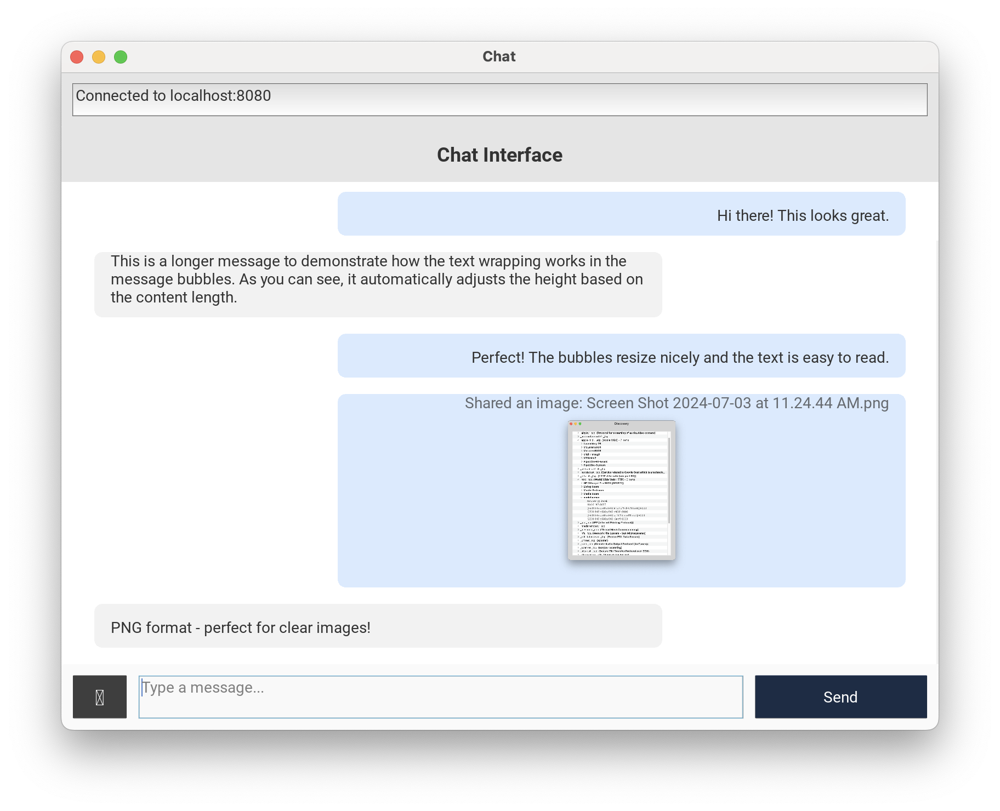
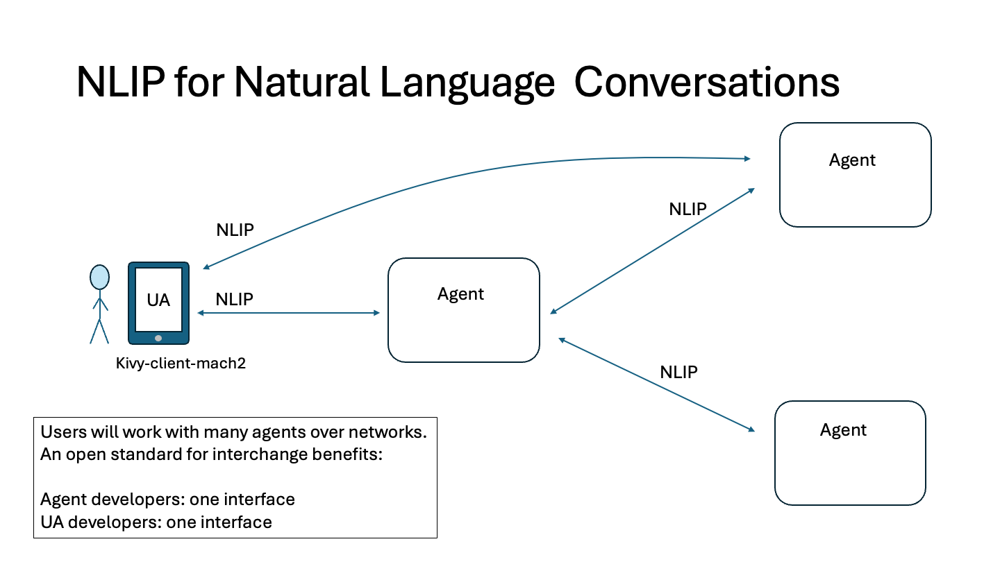
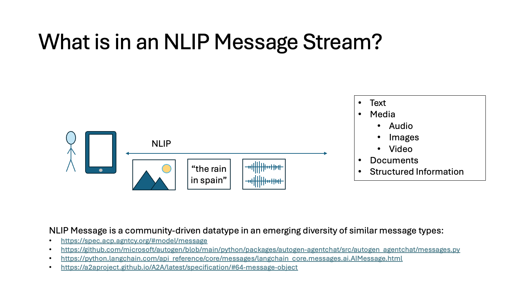
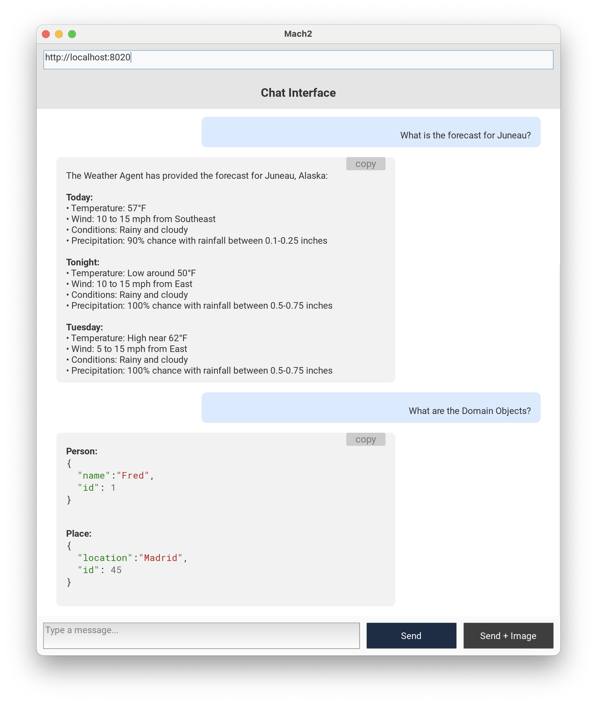

# NLIP Kivy Client

Chat client built using Kivy and speaking [NLIP](https://github.com/nlip-project) protocol on the rear.  It can send and receive:

- text
- images

By default, it renders LLM responses in rich text with hyperlinks enabled.

## Building

This project works well with `uv`.

1. Create a virtual environment.

        $ uv venv
    	$ . .venv/bin/activate
		
2. Synchronize the project dependencies

        $ uv sync
		
3. Run the app

        $ python -m mach2
        
    The app is packaged as a Python module.  Be sure to invoke with the "-m" flag as shown.
    
4. Run the app with options.  Kivy intercepts normal argument processing, and arguments for the app need to follow a double hyphen.

        $ python -m mach2 [ kivy args ] -- [ app args ]
        
    For instance, to run the app in "plain" mode with Markdown formatting disabled.
    
        $ python -m mach2 -- -p
		
    To get "help" for the app arguments.
    
        $ python -m mach2 -- -h
		

## Usage

By default, the app will connect to the server connection configured in the top input area.  You should enter a string like `http://localhost:8000`, where your NLIP server is listening.  Press `[RETURN]`.

Enter text messages in the Message area.  To send a text-only message, press the `[Send]` button.  You may also press `[SHIFT+RETURN]` to complete a text message.

To send a message that includes text and an image, first enter the text and then use the `[Send+Image]` button to add an image to the message and then send it.

LLM responses are shown in a bubble on the left.  The `[Copy]` button copies the message text into the clipboard so you can paste it into another application.

Hyperlinks are presented with underlines and clicking them opens a web browser.

## Testing and Development

Run the app with the "mock" flag to disable real HTTP connections and use mock responses.

    $ python -m mach2 -- -m
	
When set this way, the app will generate canned responses.  This can be helpful during development, when working on layout or design.

## Background Information - NLIP for Natural Language Conversations

NLIP (Natural Language Interaction Protocol) is an open standard for message interchange between intelligent agents.  It is being standardized in [Ecma Technical Committee 56](https://ecma-international.org/technical-committees/tc56/) to enable truly interoperable message exchange. 

An NLIP message stream is used to send and receive text messages augmented with media and structured data types.  It is similar in spirit to the message types defined in agent construction toolkits, but is independent from these and its definition is governed through an open community whose goals are interoperability and security.

## Screenshots

By default, Mach2 processes each LLM response with a Markdown parser and code formatter.  This capability may be turned off with the "-p" (plain) flag.

