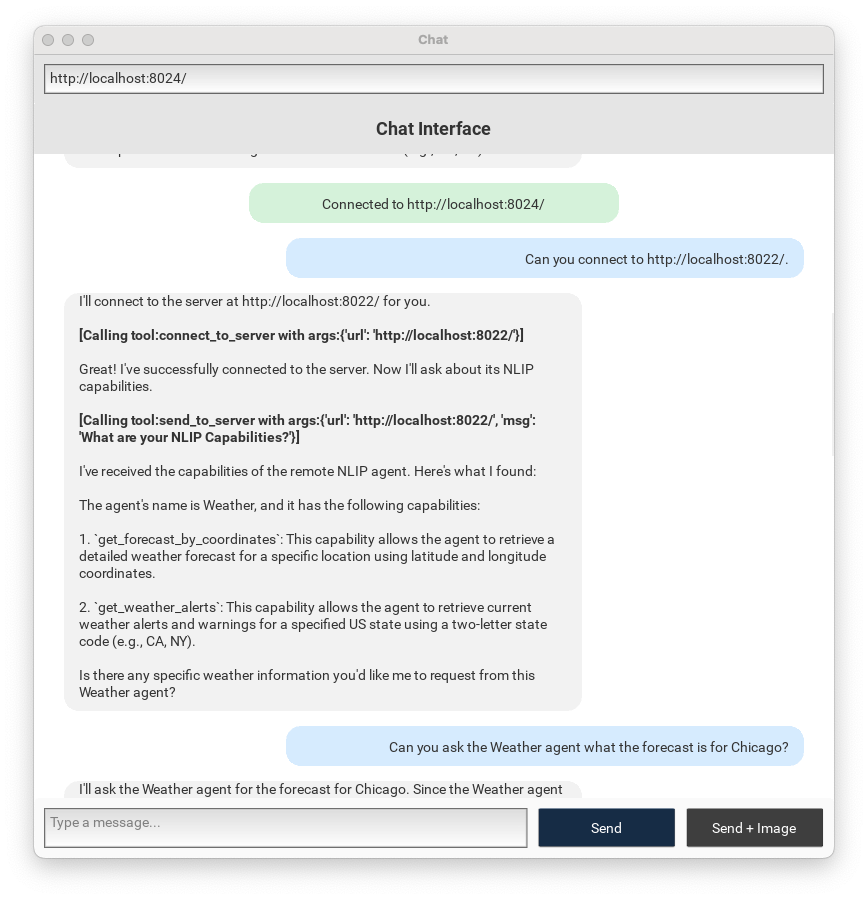

# NLIP Kivy Client

Chat client built using Kivy and speaking [NLIP](https://github.com/nlip-project) protocol on the rear.  It can send and receive:

- text
- images

## Building

This project works well with `uv`.

1. Create a virtual environment.

        $ uv venv
    	$ . .venv/bin/activate
		
2. Synchronize the project dependencies

        $ uv sync
		
3. Run the app

        $ python -m mach2
        
    The app is packaged as a Python module.  Be sure to invoke with the "-m" flag as shown.
		

## Usage

By default, the app will connect to the server connection configured in the top input area.  You should enter a string like `http://localhost:8000`, where your NLIP server is listening.  Press `[RETURN]`.

Enter text messages in the Message area.  To send a text-only message, press the `[Send]` button.  You may also press `[SHIFT+RETURN]` to complete a text message.

To send a message that includes text and an image, first enter the text and then use the `[Send+Image]` button to add an image to the message and then send it.

## Testing and Development

Set the following flag to `True` to disable the NLIP server connection.

    USE_MOCK_SERVER = True
	
When set this way, the app will generate canned responses.  This can be helpful during development, when working on layout or design.

